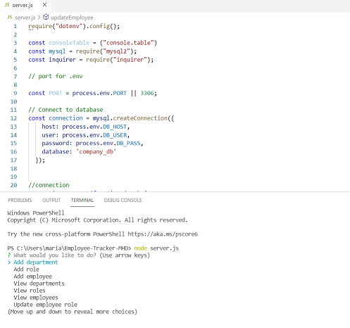
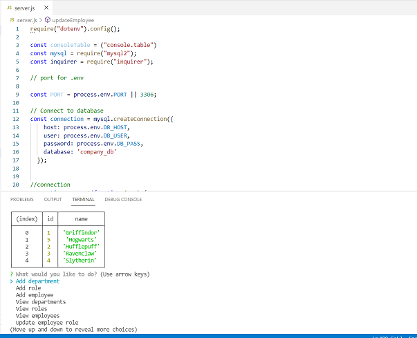

# Employee-Tracker-MHD

## Description 

Node.js command line based employee management system with basic commands to add, display and manage Departments, Roles and Employees.

## Table of Contents
* [Description](#description)
* [Application](#application)
* [Technologies](#technologies)
* [GitHub Repository](#Github)
* [GitHub Deployed](#GithubDeployed)
* [Walkthrough Video](#Walkthrough)
* [Application](#gif)

## Technologies 

* JavaScript
* Node.js
* Inquirer
* Console Table
* Dotenv
* Mysql2

## GitHub Repository

* [Employee Tracker GitHub Repository ](https://github.com/mhdavie/Employee-Tracker-MHD)

## Walkthrough Video

* [Employee Tracker Video](https://watch.screencastify.com/v/eOCOww3NtXBGfZ6ZRR7t)

## Application 

## Screenshots

